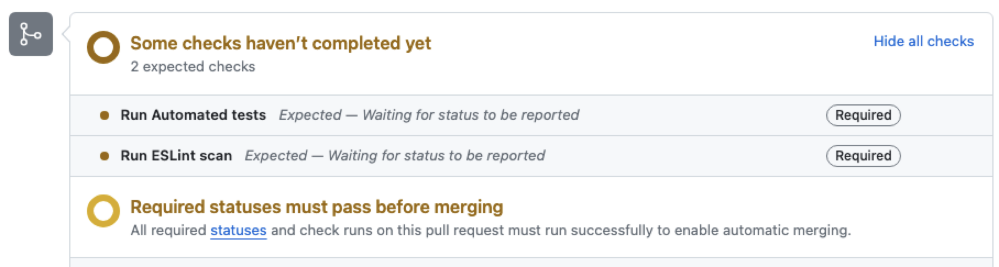

# enable-a11y

A place to learn and share with developers what makes web work accessible. This includes a list of demos to show how aria roles function with screen readers.

[Official Enable Website](https://www.useragentman.com/enable)

## Getting Started

### Prerequisite Installations

- nvm: A Node version manager.  It allows you to install several versions of node on the same machine and change versions easily.
  - [Here are instructions in how to install nvm](https://github.com/nvm-sh/nvm#usage)
  - After installing nvm, install a Node version >= 18 using nvm, ideally `nvm install 20.11.0`
- npm: a Node Package Manager, usually installed alongside Node
  - More info: [Downloading and installing Node.js and NPM](https://docs.npmjs.com/downloading-and-installing-node-js-and-npm)
- Lynx: A text-only browser used for testing for how a website will work without graphics turned on.
  - Install options:
    - [Download from browser](https://etc.usf.edu/techease/4all/web-accessibility/the-lynx-text-web-browser/)
    - Install using homebrew: `brew install lynx`
    - Install using MacPorts: `sudo port install lynx`
    - Install on Ubuntu: `sudo apt install lynx`
- PHP (version > 8.1)
  - Install options:
    - [Install from browser](https://www.php.net/downloads.php)
    - Install using homebrew: `brew install php`
    - Install using MacPorts: `sudo port install php`
    - Install on Ubuntu: `sudo apt install php8.1`
  - You can find the path to the installed PHP using `which php`. Add that path to your terminal profile's PATH environment value and/or VS Code settings.
- Java: required in order to use the v.Nu checker during automation and unit testing

> Note: Any changes to these prerequisites will need to be reflected in the GitHub Actions in order to run the CI/CD checks.

#### Optional installations (since `npm run server` will run an express server)

- MAMP (OSX) or Apache: <https://www.mamp.info/en/mac/>
- LAMP (Linux): <https://www.linux.com/training-tutorials/easy-lamp-server-installation/>

### Setup

1. Run the following commands in your Terminal or Terminal equivalent program:

    ```sh
    git clone git@github.com:PublicisSapient/enable-a11y.git
    cd enable-a11y
    npm clean-install
    ```

    > Note: Using `clean-install` instead of just `install` installs the exact package versions listed in the package-lock.json, and therefore has guaranteed compatibility.

2. Start the local server using:

    ```sh
    npm run start
    ```

3. Open <http://localhost:8888> in your browser to see the local version of the site.

4. Make sure everything is installed correctly by running the automated tests using `npm run test`.

   > See the [Chromedriver issues](#chromedriver-issues) section if you encounter an error related to Chromedriver.

## Tests

### Tools used for testing

- v.Nu: The Nu HTML Checker is used to catch unintended mistakes in the HTML, CSS, and SVG.
- Axe CLI: Uses a browser webdriver to open pages and run accessibility tests on it.
- pa11y CLI: Uses Puppeteer to run its own headless Chrome browser to run accessibility tests.
- Jest + Puppeteer: Used to run and validate code in unit tests.

Read [the Enable Code Quality article](https://www.useragentman.com/enable/code-quality.php) for the full details behind the testing tools being used and how.

### Commands

- Run all tests: `npm run test`
- Run only the Jest + Puppeteer unit tests: `npm run jest`
- Run only the v.Nu, Axe, and Pa11y tests: `npm run lint`
- Run only the v.Nu tests: `npm run test-vnu`
- Run only the Axe tests: `npm run test-axe`
- Run only the Pa11y tests: `npm run test-pa11y`

If you are noticing that the jest tests are taking a long time, you might want to run `npm run jest-debug-memory-leak`.  If the heap size for each test group increases a lot, there is a memory leak in the tests. More information about that can be found at in the article [Your Jest Tests are Leaking Memory](https://chanind.github.io/javascript/2019/10/12/jest-tests-memory-leak.html) by [David Chanin](https://chanind.github.io/about/)

> Hint: Make sure the local server is running first using the `npm run start` command.

#### Chromedriver issues

Your version of Chrome needs to match the `chromedriver` package version. You can find your version of Chrome (ie. 121.x.xxxx.xxx) by checking the version number inside the "About Chrome" dialog in Chrome.

If there is a problem with running Chromedriver, because you have an error like "SessionNotCreatedError: session not created: This version of ChromeDriver only supports Chrome version XXX", then you should ensure your chromedriver is installed with the right version.

You can change the version of chromedriver installed with this project by using `npm install -D chromedriver@XXX`, and replacing XXX with the same version of Chrome you already have installed (ie. `npm install -D chromedriver@121`).

Links at the [Chrome for Testing availability webpage](https://googlechromelabs.github.io/chrome-for-testing/) allow you to download a separate "Chrome for Testing" application, and/or the associated chromedriver files.

You can also download a chromedriver version zip file from here: <https://chromedriver.storage.googleapis.com/index.html> and then install it using:

```bash
npm install -D chromedriver --chromedriver_filepath=/path/to/chromedriver_mac64.zip
```

(you may need to change the `PATH` variable)

If you still have problems with Chromedriver, you may want to read the Stack Overflow article [Session Not Created: This version of ChromeDriver only supports Chrome version 98](https://stackoverflow.com/questions/71859550/session-not-created-this-version-of-chromedriver-only-supports-chrome-version-9).

## Development

### Contributing code

If you would like to contribute to this project, please feel free to raise a Pull Request! See the documentation at [Creating a pull request from a fork](https://docs.github.com/en/pull-requests/collaborating-with-pull-requests/proposing-changes-to-your-work-with-pull-requests/creating-a-pull-request-from-a-fork) for instructions.

### Style Notes

1. All font-sizes are converted to rems. This is done via LESS.  If you want a font-size of 20px, then you would do the following:

    ```css
      div {
        font-size: (20/@px);
      }
    ```

    The `@px` variable is set to 16rem, which is also the base font size

2. If we hide custom components and use CSS to create custom facades for them, we must ensure that these facades will be discoverable to users navigating by touch. For more information about being inclusive of users navigating by touch, please read [Inclusively Hiding & Styling Checkboxes and Radio Buttons](https://www.sarasoueidan.com/blog/inclusively-hiding-and-styling-checkboxes-and-radio-buttons/) by [Sara Soueidan](https://www.sarasoueidan.com).

### Adding An External NPM Module To The Front-End Code

If you are adding examples to this repository and need support of an external NPM module for the front-end (like a JavaScript library), then you should add the library to the `nodeFiles` array in the file `promote-node-modules-to-server.js`.  

For example, when I added the `glider-js` library to Enable so I can use it in the Carousel demos, I added the files I needed for the front-end to `nodeFiles` with these two lines:

<pre>
const nodeFiles = [
  'node_modules/indent.js/lib/indent.min.js',
  <b>'node_modules/glider-js/glider.js',
  'node_modules/glider-js/glider.css',</b>
  'node_modules/text-zoom-event/dist/textZoomEvent.module.js',
  'node_modules/dialog-polyfill/index.js',
  'node_modules/jquery/dist/jquery.min.js',
  'node_modules/jquery-validation/dist/jquery.validate.min.js',
  'node_modules/accessibility-js-routines/dist/accessibility.module.js',
  'node_modules/wicg-inert/inert.min.js'
]
</pre>

When you start the project with `npm run server`, the files in the `nodeFiles` array will be placed in the `enable-node-libs` directory in the project root.  Use this directory to load the files in your scripts, css, or HTML files.

### Pre-commit hook error - "npx: command  not found"

If you encounter an error when trying to commit some code from within an IDE (like VS Code, IntelliJ, GitHub Desktop, etc.), and the error is about the `npx` command not being found, you should try running the command in the terminal instead. This issue is due to the PATH values not being set as expected in the IDE in order for npx to be recognized. See <https://stackoverflow.com/questions/67115897/vscode-github-desktop-pre-commit-hook-npx-command-not-found> for more information.

### Pull Request from fork not completing CI/CD tests

If you are trying to contribute to the Enable site from a forked version of this repository, and the automatic tests in your Pull Request only ever show "Some checks haven't completed yet" and "Expected - Waiting for status to be reported" (see an example in the image below), then you may need to update the settings in your forked repository. The "Allow all actions and reusable workflows" option within the Actions section of the settings should be selected. Please go to the [Using GitHub Actions to Run the Tests in the CI/CD Pipeline](https://www.useragentman.com/enable/code-quality.php#using-github-actions-to-run-the-tests-in-the-ci-cd-pipeline--heading) section on this site for more details on how to find this option. After changing the setting, you will need to retrigger the actions by making another commit.



## References

When testing using screen readers, these resources may be of help to you:

- [Desktop Screen Readers Survival Guide - Basic Keyboard Shortcuts](https://dequeuniversity.com/screenreaders/survival-guide)
- [NVDA Users Guide](https://www.nvaccess.org/files/nvda/documentation/userGuide.html)
